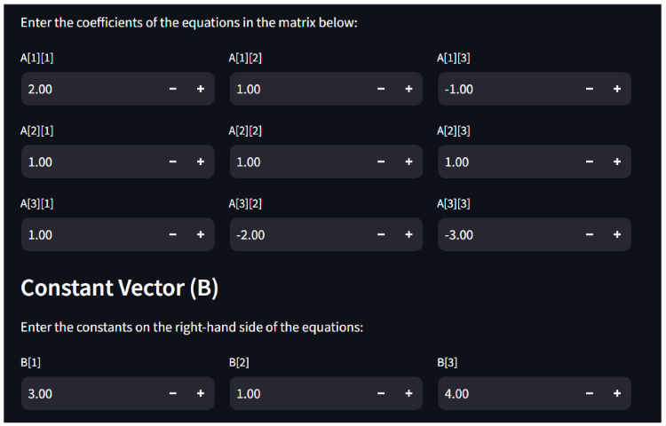
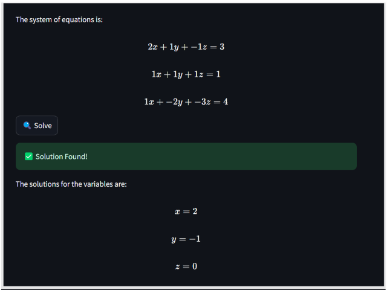

# **📊 System of Equations Solver using Cramer's Rule**

Welcome to the **System of Equations Solver**! This app, built with [Streamlit](https://streamlit.io/), allows you to solve systems of linear equations using **Cramer's Rule**. You can input your equations in matrix form, visualize them dynamically, and get a step-by-step solution.

---

## 🚀 Features

- **Matrix Representation**:
  - Input your system of equations as a **coefficient matrix (A)** and a **constant vector (B)**.
  - Dynamically display the system in the form \(AX = B\), where:
    - \(A\): Coefficient matrix
    - \(X\): Variables (x, y, z,...)
    - \(B\): Constants vector
  - Beautiful LaTeX-rendered matrices and equations.

- **Equation Visualization**:
  - Automatically generates equations from your matrix inputs.
  - Displays them with proper formatting in an easy-to-read form.

- **Dynamic Input Handling**:
  - Supports **integer and float values**:
    - Integers are displayed without decimals (e.g., \(5\)).
    - Floats are displayed with two decimal places (e.g., \(5.20\)).

- **Scalable**:
  - Solve systems with **2 to 10 variables**.
  - Easily adapt to any problem size.

- **Real-time Solutions**
    - Get solutions for \(x, y, z,...) instantly after clicking **"Solve"**.
  - Handles errors gracefully if the system is unsolvable, such as when the determinant of the coefficient matrix is zero.

---

## 🖥️ Screenshots

### 1. Input System of Equations
Input the coefficient matrix \(A\) and constants vector \(B\) using a simple interface:



---

### 2. Visualize \(AX = B\)
View your system of equations in matrix form:


---

### 3. Solution
Get the solution for (x, y, z,...) in real-time:



---

## 🧑‍💻 Usage

### Prerequisites
- Python 3.7 or higher
- Streamlit library installed

### Installation

1. Clone this repository:
   ```bash
   git clone https://github.com/ashish/soq-solver-cramer.git
   cd system-of-equations-solver
   ```

2. Install dependencies:
   ```bash
   pip install -r requirements.txt
   ```

3. Run the app:
   ```bash
   streamlit run app.py
   ```

4. Open the app in your browser at [http://localhost:8501](http://localhost:8501).

---

## 📂 Project Structure

```plaintext

├── README.md                           
├── app.py                  
├── solve_cramers_rule.py   
├── requirements.txt        
├── ax_b_ss.png              
├── LICENSE             
├── equation_ss.png               
├── solu_ss.png
├── icons8-github-50.png                           
```

---

## 🤝 Contributing

Contributions are welcome! If you have ideas for new features or want to improve the app, feel free to fork the repository and submit a pull request.

---

## 📄 License

This project is licensed under the MIT License. See the [LICENSE](LICENSE) file for details.

---

## 👤 Author  
**Ashish Patel**  
[](https://github.com/ashishpatel8736) | [](https://www.linkedin.com/in/ashishpatel8736)

---

## 🌟 Acknowledgments

- Built with [Streamlit](https://streamlit.io/) for an interactive interface.
- Inspired by the elegance of **Cramer's Rule** in linear algebra.

---

Enjoy solving your systems of equations effortlessly! 🎉
